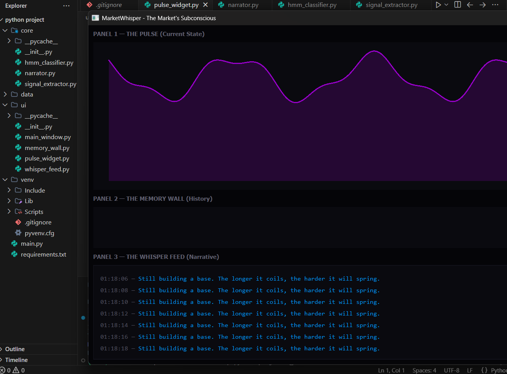

# 🕯️ MarketWhisper: The Market's Subconscious, Made Visible



> **"Every price chart you've ever seen shows you what happened. MarketWhisper shows you what the market was feeling at every moment."**

Welcome to **MarketWhisper** (Project PANTHEON-WHISPER) — a state-of-the-art, multi-model market edge detection and probabilistic execution system. This project does not rely on lagging indicators like RSI or MACD. Instead, it reconstructs the emotional narrative hidden inside order flow, volume patterns, and price microstructure, rendering it as a living, breathing visual story in real-time right in your browser.

This is not just a dashboard; it is a **Market Consciousness Visualizer**.

---

## ⚡ The Split Deployment Architecture (Netlify + Render)

To achieve maximum performance and zero-cost hosting, MarketWhisper utilizes a highly optimized **Split Deployment Architecture**. 

1. **The Brain (Render Backend):** A continuous FastAPI server that runs the heavy Python Machine Learning models (`hmmlearn`, `scikit-learn`) and computes the mathematics in the background. It holds a persistent WebSocket connection open.
2. **The Eyes (Netlify Frontend):** A blazing-fast, serverless HTML5/Canvas UI hosted on Netlify. It features a custom **"Waking Up The Server"** loading screen that gracefully waits for the Render server to boot from sleep, instantly dropping into the live feed the millisecond a connection is established.

---

## 🧠 The Magic Mechanism

Markets leave psychological fingerprints in their data. The algorithm extracts 5 core microstructure signals and feeds them into a **Hidden Markov Model (HMM)** to output one of 7 discrete market states (e.g., *🌊 Drift, 🐋 Accumulation, 💥 Panic*).

`Price Velocity + Volume Shape + Time-of-Day Rhythm + Spread Compression + Candle Body Ratios = The Hidden Emotional State`

### 🖥️ The 3 Interface Panels
* **Panel 1 — The Pulse:** A 60FPS real-time organic waveform that physically changes shape based on market stress. Calm = smooth sine wave. Panic = sharp jagged spikes. 
* **Panel 2 — The Memory Wall:** A scrolling heatmap showing the historical progression of market states. You see exactly when confusion turned into conviction.
* **Panel 3 — The Whisper Feed:** Algorithmically generated logic acting like pure intuition. It narrates the market in plain English, written in the style of an old-school tape reader's inner monologue.

---

## 🚀 The Ultimate Deployment Guide

Deploying MarketWhisper to the world is incredibly easy. You will host the Backend on Render and the Frontend on Netlify. 

### Step 1: Deploy the Brain to Render
1. Go to **[Render.com](https://dashboard.render.com/)** and log in with GitHub.
2. Click **New +** -> **Blueprint**.
3. Connect your GitHub repository. Render will automatically detect the `render.yaml` file and deploy the Python backend for you.
4. Once it is live, **copy your new Render URL** (it will look like `market-whisper-xyz.onrender.com`).

### Step 2: Link the Frontend to the Brain
1. In your code editor, open `frontend/app.js`.
2. At the very top (Line 46), find the `RENDER_BACKEND_URL` variable.
3. Paste your Render URL into the string, making sure to use `wss://` and append `/ws` at the end.
   ```javascript
   const RENDER_BACKEND_URL = "wss://market-whisper-xyz.onrender.com/ws"; 
   ```
4. Commit and push this single change to your GitHub repository.

### Step 3: Deploy the Dashboard to Netlify
1. Go to **[Netlify.com](https://www.netlify.com/)** and click **Add new site** -> **Import an existing project**.
2. Connect your GitHub repository.
3. In the "Build settings", set the **Publish directory** to: `frontend`
4. Leave the Build command completely empty.
5. Hit **Deploy Site**.

**You are done!** 🎉 When users visit your Netlify link, they will see the glowing loading screen while the Render server wakes up. As soon as it connects, the Market's Subconscious comes alive on their screen.

---

## 💻 Running Locally
If you want to run the entire stack locally on your machine:
```bash
# 1. Activate your virtual environment
python -m venv venv
.\venv\Scripts\activate  # Windows
source venv/bin/activate  # Mac/Linux

# 2. Install Dependencies
pip install -r requirements.txt

# 3. Start the Server
uvicorn app:app --reload
```
Then simply open `http://127.0.0.1:8000` in your web browser!

---
*Built for those who don't just want to predict the market, but want to feel its pulse.*
